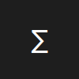

#  NumberScript — VS Code Web Extension

[](LICENSE)
[](#)
[](https://vscode.dev)

NumberScript is a symbolic mathematics language for VS Code Web. It allows you to write mathematical expressions, perform advanced operations, and visualize results with **step-by-step explanations** and **interactive graphs**.

---

## 🌟 Features

- **Mathematical Operations**: `simplify`, `expand`, `solve`, `combineLikeTerms`, `evaluate`
- **Show Work Panel**: Step-by-step computation display
- **Graph Panel**: Interactive plotting of functions and data
- **PEMDOS/GEMDOS Compatibility**: Correct operator precedence
- **Syntax Highlighting**: Keywords, functions, numbers, and comments
- **Web-Friendly**: Fully compatible with VS Code Web

---

## 🖥 Installation

```bash
git clone https://github.com/yourusername/numberscript.git
cd numberscript
npm install
npm run build
npm run package
